# OpenCS2 Panel

[](LICENSE)
[](https://github.com/enesbakis/OpenCS2/actions/workflows/ci.yml)
[](https://github.com/enesbakis/OpenCS2/pkgs/container/opencs2)

A self-hosted web panel for managing Counter-Strike 2 dedicated servers.  
Deploy in minutes with Docker Compose — no external services required.

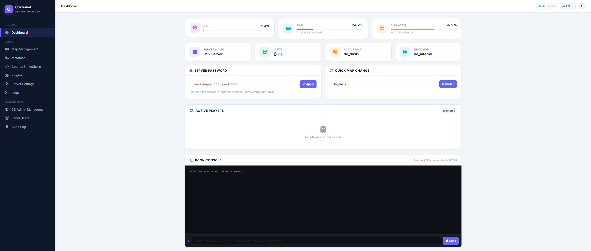

---

## Screenshots

<table>
  <tr>
    <td align="center"><b>Dashboard</b><br></td>
    <td align="center"><b>Server Settings</b><br>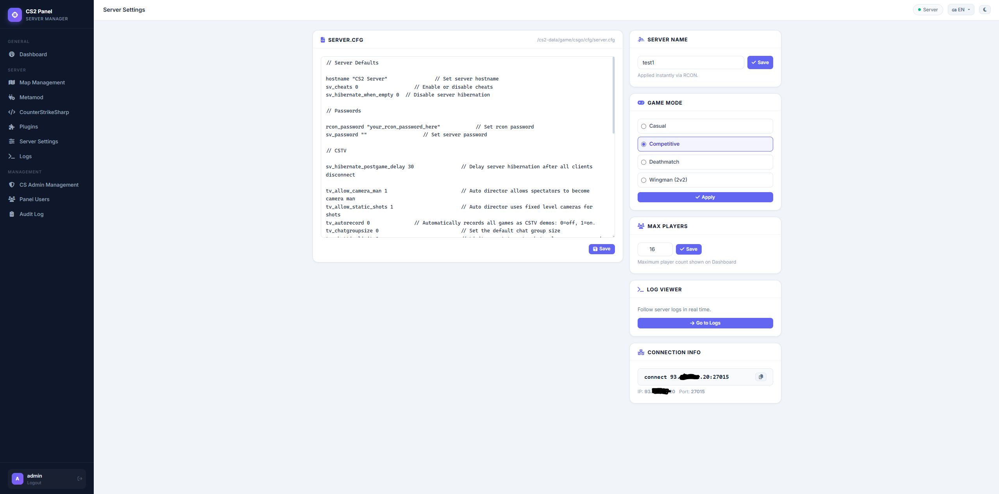</td>
  </tr>
  <tr>
    <td align="center"><b>Map Management</b><br>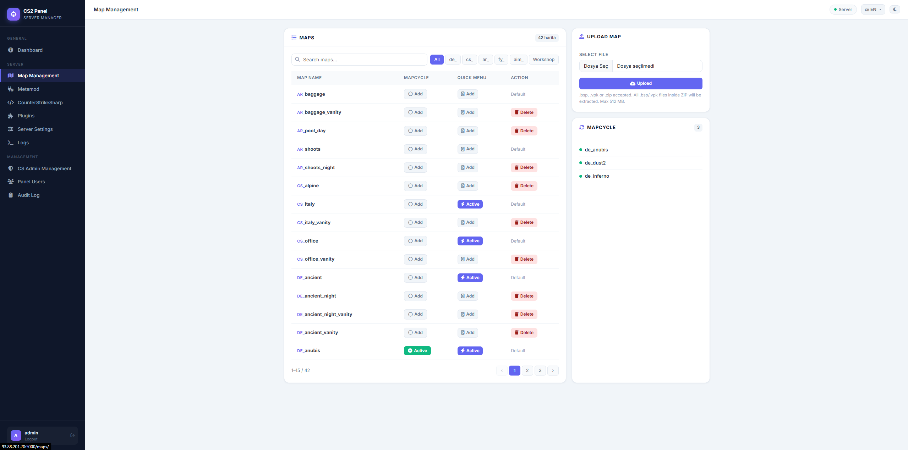</td>
    <td align="center"><b>Plugin Manager</b><br>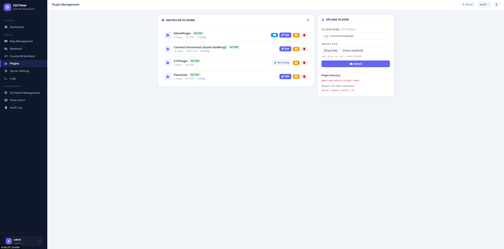</td>
  </tr>
  <tr>
    <td align="center"><b>Plugin Details</b><br>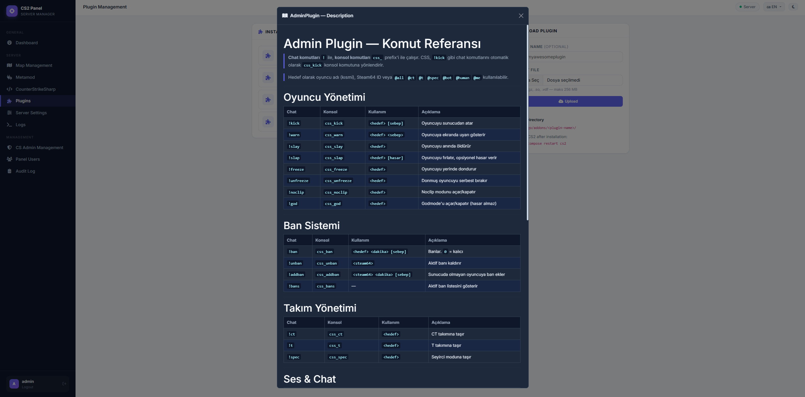</td>
    <td align="center"><b>Plugin Edit</b><br>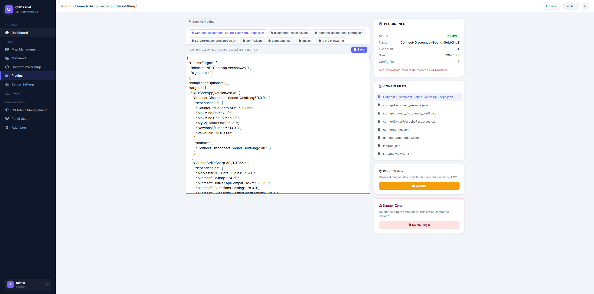</td>
  </tr>
  <tr>
    <td align="center"><b>CS2 Admin Management</b><br>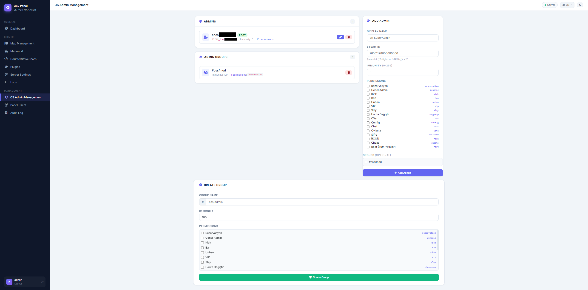</td>
    <td align="center"><b>Panel Users</b><br>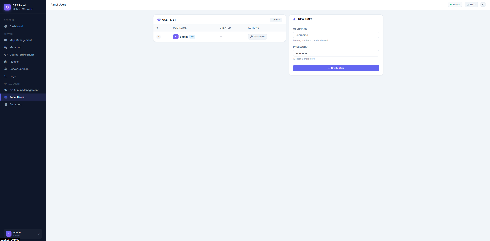</td>
  </tr>
  <tr>
    <td align="center"><b>CounterStrikeSharp</b><br>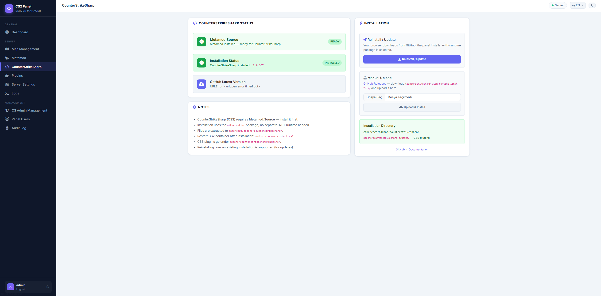</td>
    <td align="center"><b>Metamod</b><br>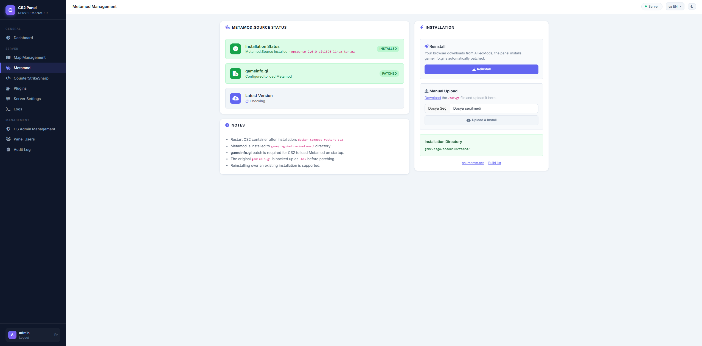</td>
  </tr>
  <tr>
    <td align="center"><b>Server Logs</b><br>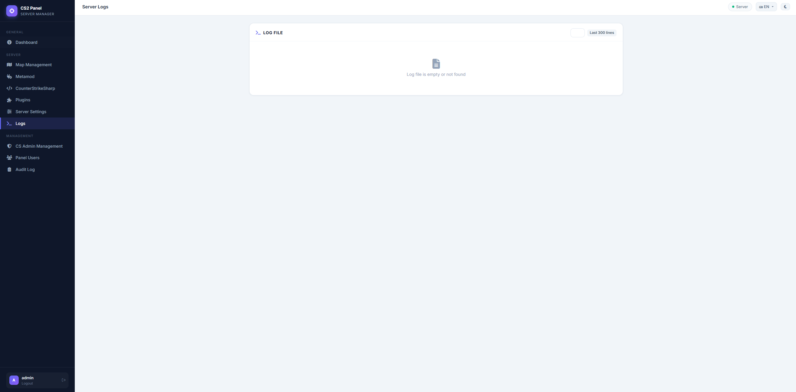</td>
    <td align="center"><b>Audit Log</b><br>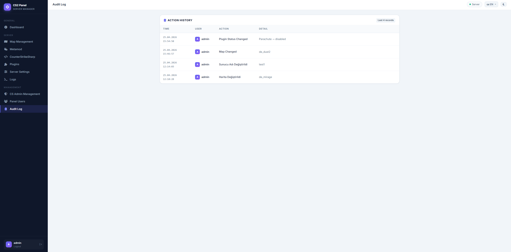</td>
  </tr>
</table>

---

## Features

- **Dashboard** — Live server status, player list, map info via RCON
- **Map Management** — Change map, manage map groups
- **Plugin Manager** — Install / remove CounterStrikeSharp plugins
- **CS2 Admin Manager** — Add / edit / remove in-game admins and groups
- **Metamod & CS:S Manager** — Toggle Metamod:Source and CounterStrikeSharp
- **User Management** — Multi-user with role-based access
- **Audit Log** — Full history of all panel actions
- **Internationalization** — English and Turkish UI (add more via Babel)

---

## Quick Start

### Requirements

- Docker ≥ 24 and Docker Compose v2
- A CS2 dedicated server (or use the bundled `cs2` service)

### 1. Clone & configure

```bash
git clone https://github.com/enesbakis/OpenCS2.git
cd OpenCS2
cp .env.example .env
# Edit .env — set SECRET_KEY, RCON_PASSWORD, SERVER_IP at minimum
```

### 2. Start

```bash
docker compose up -d
```

The panel will be available at **http://YOUR_SERVER_IP:5000**.  
Default credentials: `admin` / `changeme` — **change these immediately** via the Users page.

### 3. Update

```bash
docker compose pull panel   # if using GHCR image
# or
git pull && docker compose build panel
docker compose up -d panel
```

---

## Configuration

All settings are passed as environment variables (via `.env`).

| Variable | Default | Description |
|---|---|---|
| `SECRET_KEY` | *(required)* | Flask session secret — use a long random string |
| `RCON_PASSWORD` | *(required)* | Must match CS2 `rcon_password` cvar |
| `SERVER_IP` | `127.0.0.1` | Public IP shown in the panel |
| `RCON_HOST` | `cs2` | Hostname / IP of the CS2 container |
| `RCON_PORT` | `27015` | RCON port |
| `CS2_PORT` | `27015` | Game port (display only) |
| `CS2_MAXPLAYERS` | `0` | Max players (display only) |
| `CS2_DATA_PATH` | `/cs2-data` | Path to CS2 game data volume |
| `PANEL_ADMIN_USER` | `admin` | Initial admin username |
| `PANEL_ADMIN_PASS` | `changeme` | Initial admin password |
| `DATABASE` | `/app/data/panel.db` | SQLite database path |

See [`.env.example`](.env.example) for a full list including CS2 server options.

---

## Documentation

- [Installation Guide](docs/en/installation.md)
- [Configuration Reference](docs/en/configuration.md)
- [Kurulum Kılavuzu (Türkçe)](docs/tr/kurulum.md)
- [Contributing Translations](CONTRIBUTING_TRANSLATIONS.md)

---

## Contributing

Contributions are welcome! Please read [CONTRIBUTING.md](CONTRIBUTING.md) first.

- Bug reports → [GitHub Issues](https://github.com/enesbakis/OpenCS2/issues)
- Feature requests → [GitHub Discussions](https://github.com/enesbakis/OpenCS2/discussions)
- New translations → [CONTRIBUTING_TRANSLATIONS.md](CONTRIBUTING_TRANSLATIONS.md)

---

## Security

Found a security issue? Please **do not** open a public issue.  
See [SECURITY.md](SECURITY.md) for responsible disclosure instructions.

---

## License

[GNU Affero General Public License v3.0](LICENSE)
